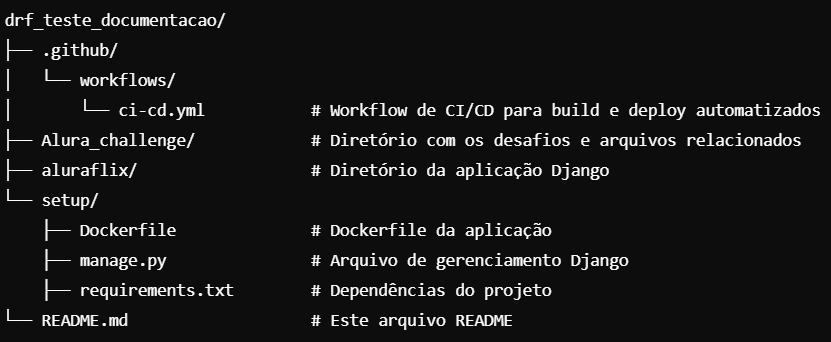
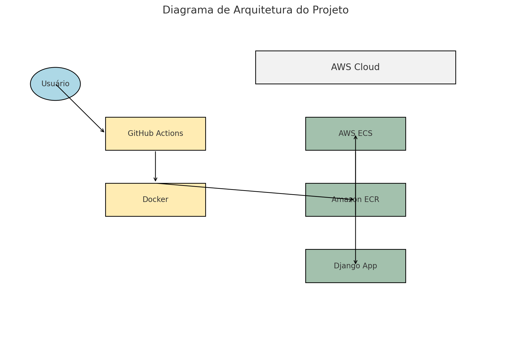
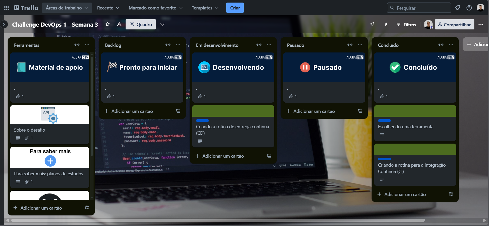
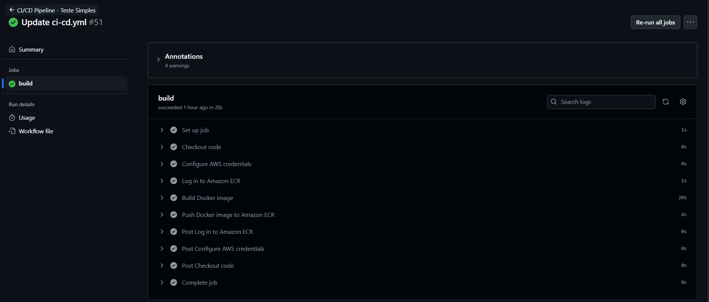
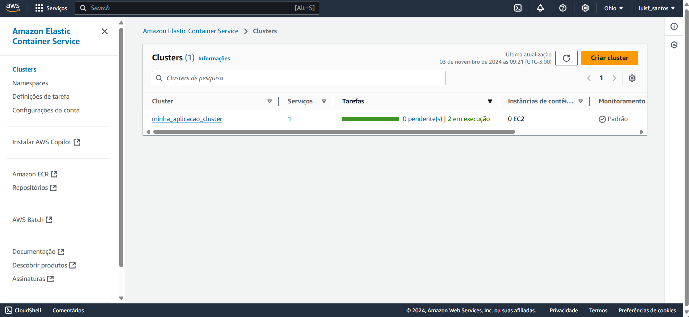
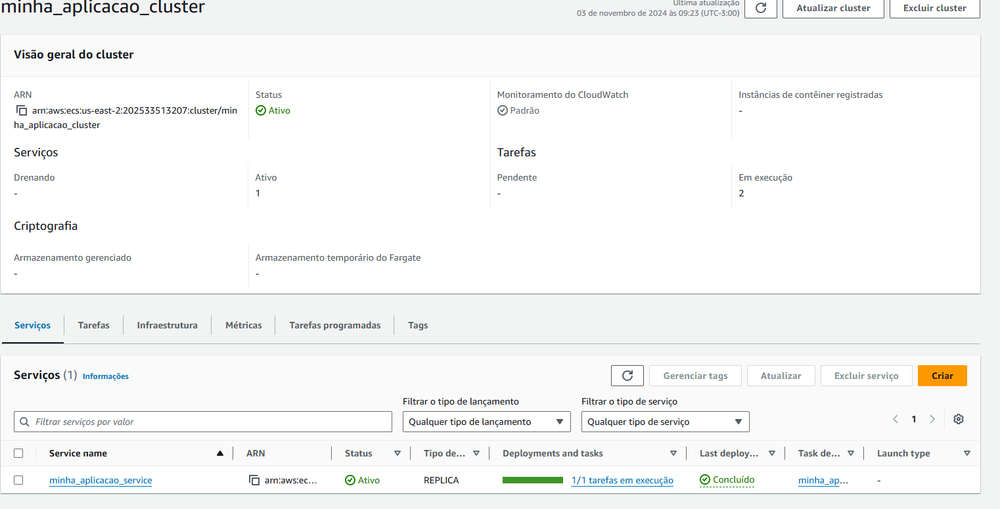

# Alura Challenge 1 - DevOps: Projeto Django no AWS ECS com Pipeline CI/CD
Este projeto faz parte do Alura Challenges - DevOps e tem como objetivo preparar uma aplicação Django para ser colocada em produção utilizando contêineres Docker e serviços de nuvem, como o Amazon ECS. Um pipeline de Integração Contínua (CI) e Entrega Contínua (CD) foi configurado com GitHub Actions, Docker e Amazon ECS, automatizando o processo de build, upload e deploy da imagem Docker na AWS.

# Estrutura do Projeto

# Implantação e Monitoramento
Depois que o pipeline CI/CD está configurado, qualquer push na branch main dispara o seguinte processo:

1. Build da imagem Docker.
2. Upload da imagem para o Amazon ECR.
3. Atualização da aplicação no Amazon ECS.

# Requisitos
 - AWS CLI: Para interagir com os serviços da AWS.
 - Docker: Para criar e gerenciar contêineres da aplicação.
 - GitHub Actions: Para o pipeline de CI/CD.
 - AWS ECS: Para gerenciar e executar a aplicação em contêineres.
 - Amazon ECR: Para armazenar a imagem Docker.

# Diagrama de arquitetura

# Trello do desafio

# Actions funcionando

# AWS Cluser

# AWS Service

